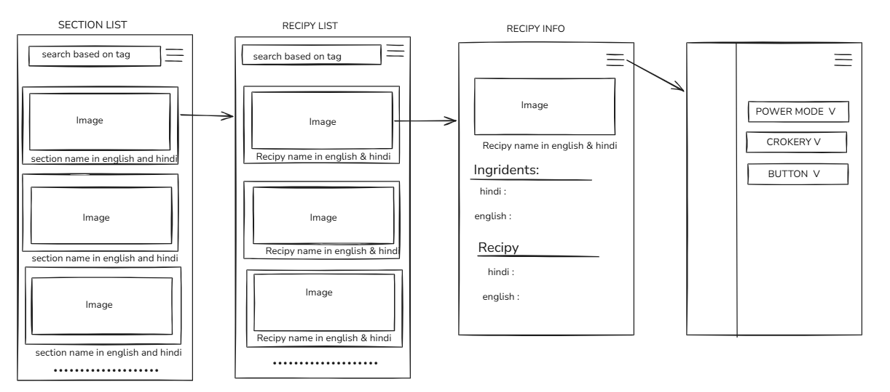
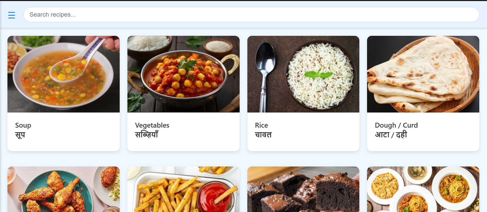
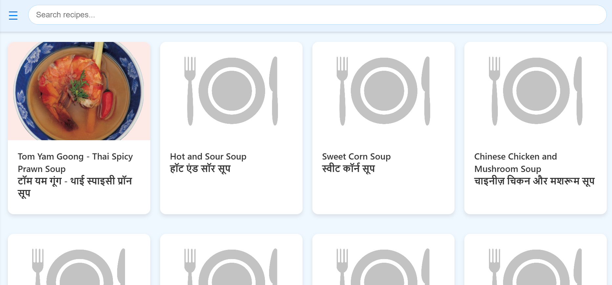
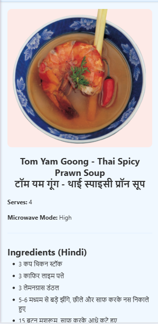

# Microwave Recipe Web App

Food Recipe App For Samsung Microwave MC28H5025

During the recent **Iran–Israel conflict**, global energy supply was disrupted and it started affecting cooking gas availability in many places. Since a large portion of LPG comes through the Middle East, disruptions around the **Strait of Hormuz and regional energy infrastructure** can impact gas prices and supply worldwide.

Because of this, I started thinking about alternatives for cooking. We had a **microwave at home but almost never used it**, mainly because I didn't know the different modes, buttons, and recipes that could be cooked in it.

So I built a small **Microwave Recipe Web App** as a quick **1-day project using vibe coding**.

The idea was simple:
create a small app where I can quickly browse recipes and understand **which microwave mode, power level, or button code to use**.

---

## Live Site

http://microwave-recipe.me/

https://ujwalsahu123.github.io/Food-Recipe-App-For-Samsung-Microwave-MC28H5025/

---

## What the App Does

The app acts like a **digital microwave recipe guide**.

You can:

• Browse recipes by **sections**
• View **ingredients and recipe steps** in **Hindi and English**
• See **microwave mode / power / button code** for cooking
• Search recipes using **name, tags, microwave code, or button code**
• Open a **sidebar guide** explaining microwave **power modes, crockery, and buttons**

---

## UI Flow

---

### 1. Sections Page

* Shows recipe categories
* Section name displayed in English and Hindi

---

### 2. Recipe List Page

* Shows recipes for a selected section
* Recipe name displayed in English and Hindi

---

### 3. Recipe Detail Page

* Recipe image
* Serves info
* Microwave mode / code / button
* Ingredients (Hindi → English)
* Recipe steps (Hindi → English)

---

### 4. Sidebar Menu

* Microwave **Power modes**
* **Crockery guide**
* **Button explanations**

---

## Tech Stack

HTML
CSS
Vanilla JavaScript
JSON (for data storage)

Hosted using **GitHub Pages**.

---

## Note

This was built as a **small experimental project in one day** to make microwave cooking easier and to explore building a **simple data-driven web app using only vanilla JS**.

Microwave: Samsung Smart Oven MC28H5025VL/TL
